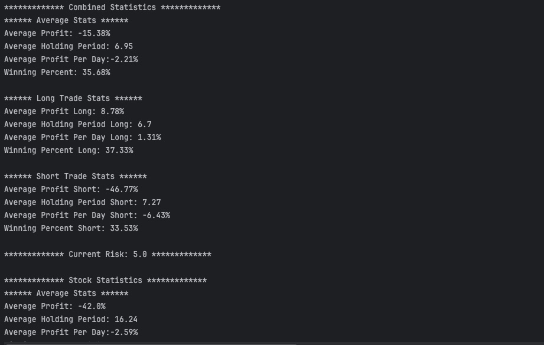

📈 A powerful project designed for analyzing stock market trends, exploring historical data, and visualizing financial insights. 
This project uses Java for stock market analysis.



💻 ## Algorithms and Technical Analysis
### Price Analysis
- Moving Average (MA)
    - Simple Moving Average (SMA)
    - Exponential Moving Average (EMA)
- Relative Strength Index (RSI)
- Moving Average Convergence Divergence (MACD)

∰ ### Volume Analysis
- Volume Weighted Average Price (VWAP)
- On-Balance Volume (OBV)

### Trend Analysis
- Support and Resistance Levels
- Trend Line Detection
- Fibonacci Retracements

💿 ## Data Sources
### Market Data
- Historical Price Data
    - Daily OHLCV (Open, High, Low, Close, Volume)
    - Intraday price movements
    - Adjusted closing prices

### Data Providers
    - 10 Year Historical data archives from Yahoo Finance

### Data Format
- CSV files
- JSON format
- Direct API connections

## Getting Started

### Prerequisites
- Java Development Kit (JDK)
- Your preferred Java IDE (The project includes .idea files, suggesting IntelliJ IDEA usage)

⎔ ### Installation
1. Clone the repository
```bash
git clone https://github.com/ElvinGarcia/Stock-Market-Analysis.git